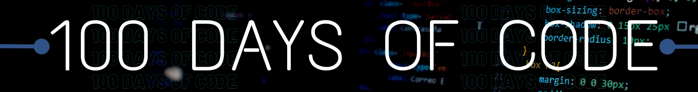

<H1 align="center"> 100 DAYS OF CODE </H1>

 

 

<H3 align="center">Objective</H3>

To help people get started with coding as a daily habit. Aim is to stay consistent with No-Zero-Days and work towards our goals, one small effort at a time! Join our [Discord Server](https://discord.gg/JFWP8c2gPG) for more information, getting awesome resources, better productivity and motivation.

---

### How to contribute?

1. Fork this Repository.
2. Make a directory with your username.
3. There are two options :-

    a. Create different directories for each day, i.e. Day_1, Day_2, Day_3 ... and so on.

    b. Push all the code into your main directory. (The one you created with your usedname) 

    Do any of the 3(a) or 3(b)

---
_Maintainers_ : [Saurabh](https://github.com/srbhr), [Himanshu](https://github.com/himanshu007-creator) , [Mahi](https://github.com/mahimonga), [Soham](https://github.com/soham117) 